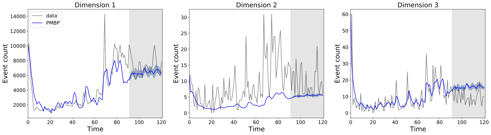

# Partial Mean Behavior Poisson (PMBP) Implementation

## Description 

Implementation of the PMBP(D,E) model introduced in "Partial Multivariate Interval-censored Hawkes Processes" by Pio Calderon, Alexander Soen, and Marian-Andrei Rizoiu. (Preprint out soon.)

## Usage

Create a conda environment from the provided YAML file `environment.yml` using the command

```
conda env create
```

The PMBP class in `code/pmbp.py` is a wrapper for defining, fitting, and evaluating the PMBP(D,E) given input data and configuration.

A sample script is provided in `sample.py`. Running this script triggers the entire pipeline, consisting of PMBP initialization, fitting, and evaluation.

The basic procedure to define and fit the model is as follows:

```
pmbp = PMBP()
pmbp.initialize(data_label, history, E, end_train, end_validation, end_test)
pmbp.fit()
```

Without any input to the `fit()` method, no hyperparameter tuning is performed. If one wishes to perform hyperparameter tuning, a grid of hyperparameters values to test must be provided, and the `fit()` command should be replaced with

```
pmbp.fit(perform_hyperparameter_tuning=True, grid=grid)
```

where `grid` is a list of hyperparameter tuples (`dimension_weights`, `nu_regularization_weight`, `gamma_init`).

Once the model is fitted, the model can be evaluated in terms of RMSE error on the dimension 1 time series predictions using

```
pmbp.evaluate()
```

This function implicitly samples the PMBP(D,E) process on the test set, with the number of samples controlled by the `pmbp.n` parameter (default set to 5).

Performance metrics and predictions can be printed out using the following two commands:

```
pmbp.print_performance_metrics()
pmbp.print_parameters()
```

Lastly, the fit of the model on the train-val set and predictions on the test set can be plotted using

```
pmbp.plot_predictions()
```

This saves a PDF plot to the `output/` folder.



## License

Both dataset and code are distributed under the [Creative Commons Attribution-NonCommercial 4.0 International (CC BY-NC 4.0) license](https://creativecommons.org/licenses/by-nc/4.0/). If you require a different license, please contact us at <piogabrielle.b.calderon@student.uts.edu.au>
or <Marian-Andrei@rizoiu.eu>.

